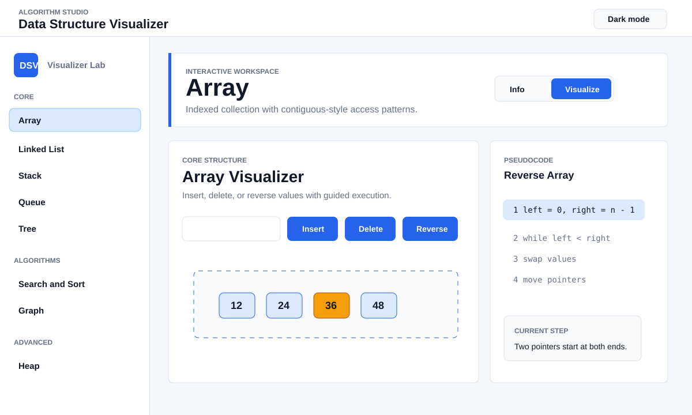
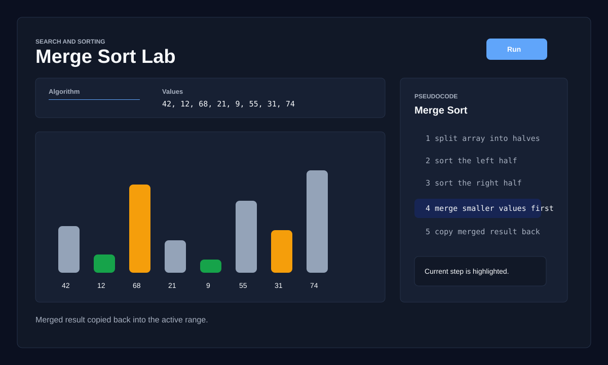
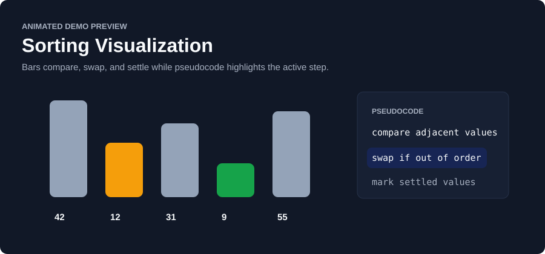

# Data Structure Visualizer

An interactive algorithm visualization platform built with React and Vite. It helps learners understand data structures and algorithms through animated operations, pseudocode tracing, operation history, adjustable animation speed, and guided step explanations.

This project is designed as a portfolio-grade frontend engineering project: reusable components, centralized configuration, pure algorithm modules, validation helpers, and automated tests are included.

## Live Demo

Live demo: Deployment URL pending.

After deploying, replace this line with your public link, for example:

```md
Live demo: https://algorithimstudio.vercel.app/
```

## Preview







## Why I Built This

Most data structure learning tools show either static diagrams or isolated animations. I wanted to build a more complete learning workspace where a user can:

- choose a structure or algorithm,
- run real operations,
- see the visual state change,
- read the current pseudocode step,
- control animation speed,
- review operation history,
- and compare time complexity.

The goal was not only to demonstrate React UI skills, but also to show algorithmic thinking, state management, code organization, and testing discipline.

## Features

- Visualizers for arrays, linked lists, stacks, queues, trees, graphs, heaps, searching, and sorting.
- Binary search, bubble sort, merge sort, and quick sort animations.
- Graph algorithm visualizations for BFS, DFS, and Dijkstra.
- Max heap insert and extract-max operations.
- Step-by-step pseudocode highlighting.
- Operation history panel.
- Animation speed control.
- Random data generation and reset controls.
- Export/share workspace snapshot action.
- Keyboard shortcuts:
  - `V` opens Visualize mode.
  - `I` opens Info mode.
  - `R` generates random data.
  - `Esc` resets the active workspace.
- Light and dark mode.
- Responsive layout for desktop and mobile.

## Tech Stack

- React
- Vite
- JavaScript
- CSS custom properties
- Node test runner
- ESLint

## Engineering Decisions

- Centralized data structure metadata in `src/config/dataStructures.js` so labels, descriptions, topics, and complexity values have one source of truth.
- Split pure algorithm logic into `src/lib` modules so behavior can be tested without rendering React components.
- Added reusable UI components such as `ControlPanel`, `VisualizerCard`, `OperationLog`, and `ComplexityTable`.
- Kept visual animation state inside React components while moving reusable operations into pure functions.
- Added validation helpers for numeric inputs to avoid invalid algorithm states.
- Used Node's built-in test runner to keep the project lightweight and dependency-free.
- Preserved a consistent visual system across core structures, algorithms, and advanced labs.

## Data Structures and Algorithms

| Area | Included |
| --- | --- |
| Array | Insert, delete, reverse |
| Linked List | Singly, doubly, circular, insert, delete, reverse |
| Stack | Push, pop, underflow handling |
| Queue | Simple, circular, deque, priority queue |
| Tree | Binary tree, BST, traversal, delete |
| Search | Binary search |
| Sorting | Bubble sort, merge sort, quick sort |
| Graph | BFS, DFS, Dijkstra |
| Heap | Max heap insert, extract max |

## Complexity Overview

| Structure / Algorithm | Key Operation | Complexity |
| --- | --- | --- |
| Array | Access | O(1) |
| Array | Search | O(n) |
| Linked List | Access | O(n) |
| Stack | Push / Pop | O(1) |
| Queue | Enqueue / Dequeue | O(1) |
| Binary Search | Search | O(log n) |
| Bubble Sort | Sort | O(n^2) |
| Merge Sort | Sort | O(n log n) |
| Quick Sort | Sort | O(n log n) average |
| BFS / DFS | Traversal | O(V + E) |
| Dijkstra | Shortest path | O((V + E) log V) |
| Heap | Insert / Extract | O(log n) |

## Project Structure

```text
src/
  components/
    AlgorithmTrace.jsx
    ComplexityTable.jsx
    ControlPanel.jsx
    OperationLog.jsx
    VisualizerCard.jsx
    *Visualizer.jsx
  config/
    dataStructures.js
  lib/
    arrayOps.js
    graphOps.js
    heapOps.js
    sortSearchOps.js
    stackOps.js
    validation.js
    *.test.js
  styles/
    global.css
  App.jsx
  main.jsx
```

## Quick Start

```bash
npm install
npm run dev
```

Open the local Vite URL, usually:

```text
http://localhost:5173
```

## Available Scripts

```bash
npm run dev
npm run build
npm run lint
npm test
npm run preview
```

## Quality Checks

The project includes automated tests for core operations:

- array insert, delete, and reverse,
- stack push and pop,
- heap insert, extract, and build,
- binary search and sorting,
- graph traversal and shortest paths,
- numeric input validation.

Run all checks:

```bash
npm run lint
npm test
npm run build
```

## Screenshots and Demo GIFs

Current preview assets are stored in:

```text
docs/screenshots/
```

Current media included:

- `dashboard-preview.svg`: application workspace preview.
- `algorithm-lab-preview.svg`: search and sorting lab preview.
- `sorting-demo.svg`: animated sorting demo preview.

Recommended next media to add before applying:

- `dashboard-demo.gif`: switching between visualizers.
- `graph-demo.gif`: Dijkstra running on the weighted graph.

## Deployment

Recommended options:

- Vercel
- Netlify
- GitHub Pages

For Vercel or Netlify, use:

```text
Build command: npm run build
Output directory: dist
```

Once deployed, update the Live Demo section at the top of this README.

## Resume Description

Built an interactive data structure and algorithm visualization platform in React featuring animated operations, pseudocode tracing, graph algorithms, heap operations, reusable UI components, centralized configuration, input validation, and automated tests.